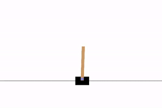

# DA6400_RL_PA1

## Submitted by
Jayagowtham J ME21B078

Lalit Jayanti ME21B096

## File Structure 

```
├── configs
│   ├── cartpole_qlearning.yaml
│   ├── cartpole_sarsa.yaml
│   ├── minigrid_qlearning.yaml
│   ├── minigrid_sarsa.yaml
│   ├── mountaincar_qlearning.yaml
│   └── mountaincar_sarsa.yaml
├── results
├── scripts
│   ├── agents.py
│   ├── tilecoding.py
│   └── training.py
├── cartpole_qlearning_tune.py
├── cartpole_sarsa_tune.py
├── cartpole_training.ipynb
├── mountaincar_qlearning_tune.py
├── mountaincar_sarsa_tune.py
├── mountaincar_training.ipynb
├── minigrid_qlearning_tune.py
├── minigrid_sarsa_tune.py
├── minigrid_training.ipynb
├── requirements.txt
├── README.md
```
## Basic usage
- ```pip install -r requirements.txt```
- To run experiments with different hyper-parameters
    - ```wandb login```
    - Choose a configuration file from <i>/configs</i>
    - Change <i>project</i> and <i>entity</i> to your requirements
    - Change interpreter path to match your python path
    ```
    python3 {env}_{algorithm}_tune.py
    # env       {cartpole, mountaincar, minigrid}
    # algorithm {qlearning, sarsa}
    ```
- To analyze results, fill the hyperparameters in the second cell and run
  - Cartpole  : [cartpole_training.ipynb](cartpole_training.ipynb)
  - MountainCar  : [mountaincar_training.ipynb](mountaincar_training.ipynb)
  - MiniGrid  : [minigrid_training.ipynb](minigrid_training.ipynb)
  - Make sure to select the correct kernel for your system from the top-right corner of your notebook, while running the above notebooks

## Results
Following are a few visulaizations showing the performance of the SARSA and Q-Learning agents in the respective environments.

### CartPole-v1
 <table>
  <tr>
    <td></td>
    <td> </td>
  </tr>
</table> 

### MountainCar-v0
 <table>
  <tr>
    <td></td>
    <td> </td>
  </tr>
</table> 

### MiniGrid-Dynamic-Obstacles-5x5-v0
 <table>
  <tr>
    <td></td>
    <td> </td>
  </tr>
</table> 